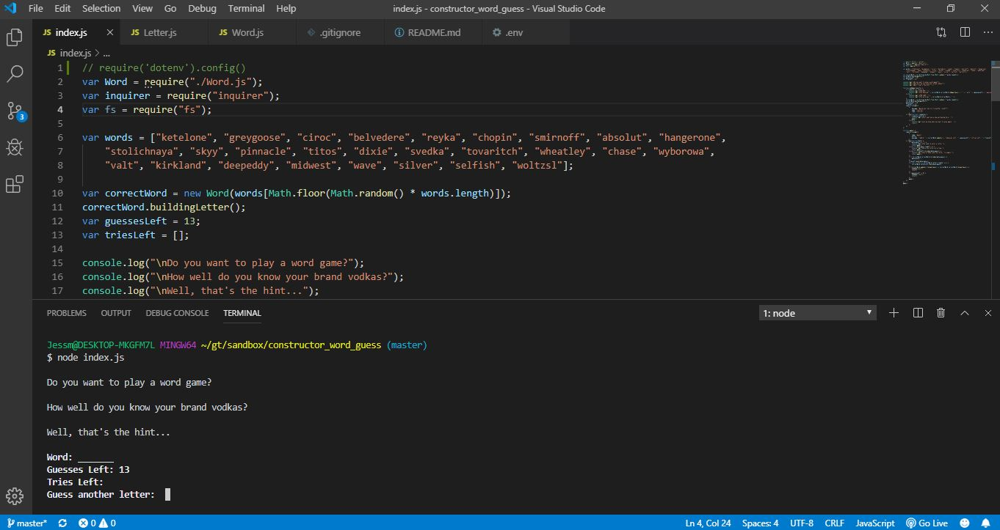
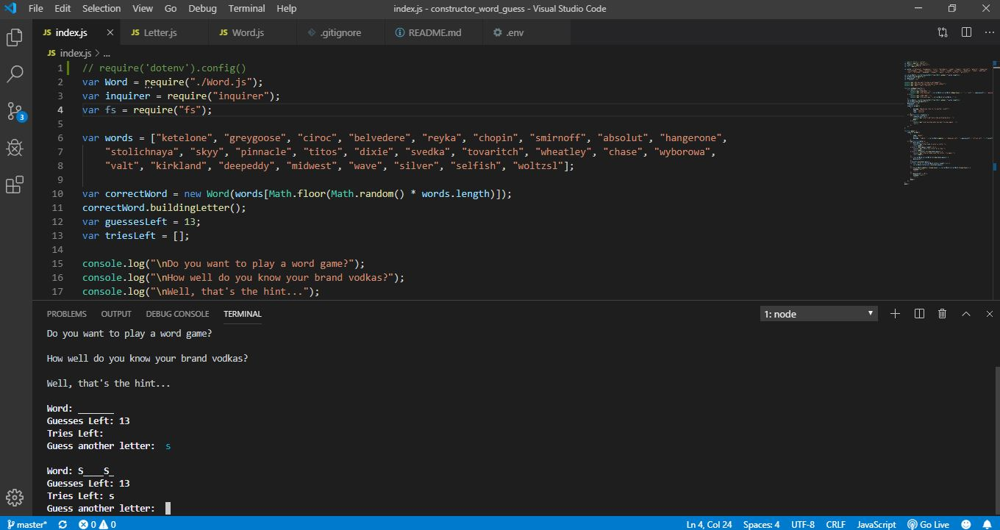
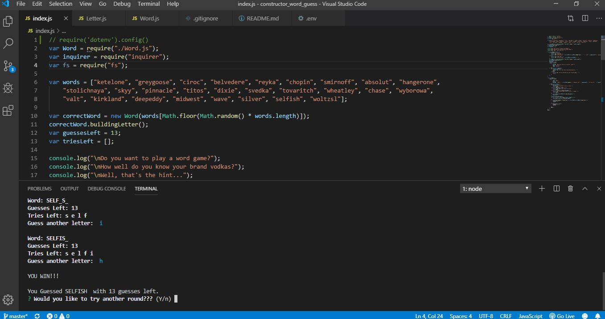
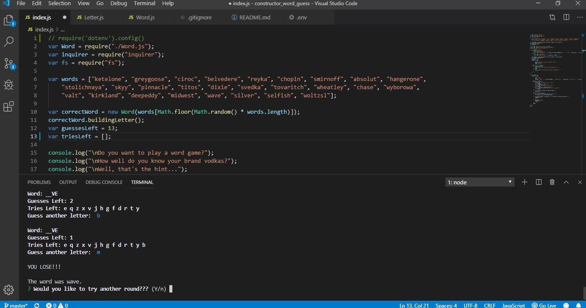

# constructor_word_guess
/play crickets
#Command Line Interface Hangman Game:

##Description:
* Using the terminal, I created a backend constructor hangman game.
* It works by entering a single letter at a time into the bash terminal to see if the user guessed the correct letter for the secretword.
* The goal of this activity is to create a hangman game on my backend command line interface.

